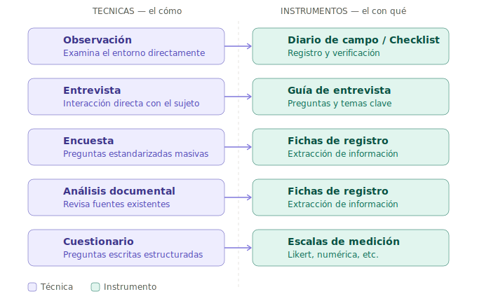
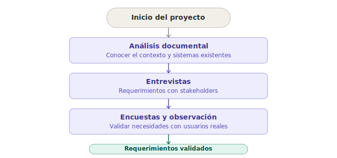

# Técnicas e Instrumentos de Investigación y Recolección de Datos

> **Guía de referencia para presentaciones** — Análisis y Desarrollo de Software (ADSO)

---

## Concepto clave

| Concepto | Definición | Pregunta que responde |
|---|---|---|
| **Técnica de investigación** | Procedimiento sistemático para obtener datos | *¿Cómo se obtienen los datos?* |
| **Instrumento de recolección** | Herramienta que registra la información | *¿Con qué se capturan los datos?* |

> La técnica es el *método*, el instrumento es la *herramienta*.

---

## Mapa general

```
INVESTIGACION
    │
    ├── TECNICAS (el cómo)
    │       ├── Observación
    │       ├── Entrevista
    │       ├── Encuesta
    │       ├── Análisis documental
    │       └── Cuestionario
    │
    └── INSTRUMENTOS (el con qué)
            ├── Diario de campo / Checklist
            ├── Guía de entrevista
            ├── Fichas de registro
            └── Escalas de medición
```

---

## Técnicas de Investigación

### 1. Observación

Examinar directamente un fenómeno, proceso o comportamiento **en su entorno natural**.

- **Directa:** el investigador presencia el evento en persona.
- **Indirecta:** se apoya en registros como videos, logs o reportes.
- **Participante:** el investigador interactúa con el entorno.
- **No participante:** solo observa, sin intervenir.

Usos típicos: análisis de procesos empresariales, identificación de flujos de trabajo, detección de problemas operativos.

---

### 2. Entrevista

Interacción **directa** entre investigador y sujeto para obtener información detallada.

- **Estructurada:** preguntas definidas previamente, sin variaciones.
- **Semiestructurada:** guía flexible, permite explorar temas emergentes.
- **No estructurada:** conversación abierta y libre.

Ventajas: permite profundidad, aclaraciones en tiempo real y captura matices que otros métodos no detectan.

---

### 3. Encuesta

Recolección de datos mediante **preguntas estandarizadas** aplicadas a una muestra amplia. Sus resultados son cuantificables y comparables, y puede escalar a cientos o miles de personas.

```
Tipos de preguntas:

  Cerradas  →  Opción múltiple, Escala Likert (1 a 5), Verdadero/Falso
  Abiertas  →  Respuesta libre del encuestado
```

---

### 4. Análisis Documental

Revisión de **fuentes existentes** para extraer información relevante sin interacción directa con personas.

Fuentes habituales: documentación técnica, informes y actas, bases de datos, normativas y marcos legales.

Aplicación típica: levantamiento de requerimientos y análisis histórico de sistemas existentes.

---

### 5. Cuestionario

Instrumento estructurado de preguntas que puede aplicarse de forma autónoma o como soporte de otras técnicas. A diferencia de la encuesta, el cuestionario no implica necesariamente una aplicación masiva: puede usarse en entrevistas individuales o para recoger datos de un grupo pequeño.

- Tipos de preguntas: cerradas, abiertas o mixtas.
- Ejemplo de uso: formularios en línea (Google Forms), formularios impresos.

```
Escala Likert (1 a 5):

  1 ────── 2 ────── 3 ────── 4 ────── 5
Totalmente  En    Neutral   De    Totalmente
en desac.  desac.          acuerdo de acuerdo
```

---

## Instrumentos de Recolección

### Diario de campo

Registro detallado de observaciones realizadas durante el trabajo de campo. Incluye fecha y hora, contexto, descripción del evento e interpretación del investigador.

### Guía de entrevista

Documento que orienta la conversación. Su estructura incluye una introducción, preguntas principales y preguntas de profundización.

### Lista de chequeo *(Checklist)*

Permite verificar la **presencia o cumplimiento** de criterios específicos. Se usa en evaluación de procesos, auditorías y validación de requisitos de software.

### Fichas de registro

Herramienta para sistematizar la información extraída de fuentes documentales. Permiten organizar datos por categorías para su posterior análisis.

### Escalas de medición

Cuantifican percepciones o actitudes de forma numérica. La más usada es la escala Likert (1 a 5).

---

## Relación técnica — instrumento



---

## Criterios para seleccionar técnica e instrumento

Antes de elegir, responde estas preguntas:

```
1. ¿Cuál es el objetivo de la investigación?
        └── Define qué tipo de información necesitas

2. ¿Qué tipo de datos necesito?
        ├── Cualitativos  →  Entrevista, Observación
        └── Cuantitativos →  Encuesta, Cuestionario, Escalas

3. ¿Quién es mi población objetivo?
        └── Tamaño, accesibilidad, perfil del grupo

4. ¿Qué recursos tengo disponibles?
        └── Tiempo, presupuesto, acceso a participantes

5. ¿Qué nivel de precisión requiero?
        ├── Alta profundidad  →  Entrevista
        └── Alta amplitud     →  Encuesta masiva
```

---

## Aplicación en Desarrollo de Software (ADSO)

| Técnica | Aplicación en ADSO |
|---|---|
| **Entrevista** | Levantamiento de requerimientos con stakeholders y clientes |
| **Encuesta** | Validación de necesidades con usuarios finales del sistema |
| **Observación** | Análisis de procesos actuales que el software va a automatizar |
| **Análisis documental** | Revisión de sistemas existentes, manuales y normativas vigentes |

### Flujo típico en un proyecto de software



---

## Conclusión

> La correcta selección y aplicación de técnicas e instrumentos garantiza la **calidad**, **validez** y **confiabilidad** de la información recolectada.
>
> Esto impacta directamente en:
> - La **precisión del análisis** realizado
> - La **efectividad de las soluciones** propuestas
> - La **satisfacción del cliente o usuario final**
