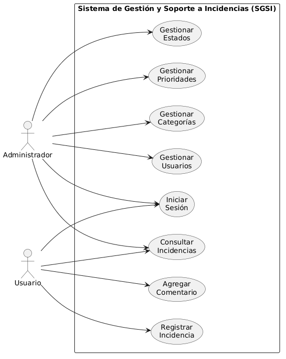
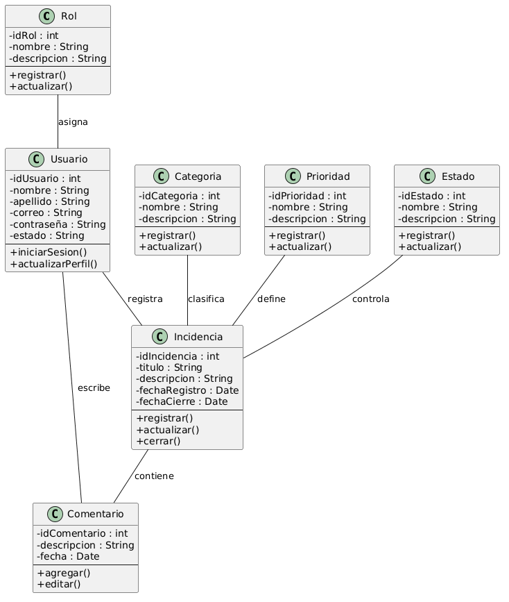

# Sistema de Gestión y Soporte a Incidencias (SGSI)

Integrantes 

Jaminton Peña

Julian Camargo

Juan Horta

## Planteamiento del Problema

Las organizaciones requieren una herramienta que permita registrar, controlar y dar seguimiento a las incidencias reportadas por los usuarios. Cuando este proceso se realiza de forma manual o mediante diferentes medios de comunicación, la información puede perderse, duplicarse o presentar retrasos en su atención.

El Sistema de Gestión y Soporte a Incidencias (SGSI) surge como una solución para centralizar el registro de incidencias, facilitar su seguimiento y mejorar la administración de la información durante todo su ciclo de vida.

## Objetivo General

Desarrollar un sistema que permita registrar, administrar y realizar seguimiento a las incidencias reportadas por los usuarios, facilitando su gestión mediante una plataforma organizada y centralizada.

## Objetivos Específicos

• Registrar incidencias de forma organizada.

• Administrar usuarios y sus roles dentro del sistema.

• Gestionar categorías, prioridades y estados de las incidencias.

• Permitir consultar el estado de las incidencias registradas.

• Registrar comentarios asociados a cada incidencia.

## Ingeniería de Requisitos

### Requisitos Funcionales

RF-01. El sistema debe permitir el inicio de sesión de los usuarios.

RF-02. El administrador debe gestionar la información de los usuarios.

RF-03. El usuario debe registrar nuevas incidencias.

RF-04. El sistema debe permitir consultar las incidencias registradas.

RF-05. El administrador debe gestionar las categorías.

RF-06. El administrador debe gestionar las prioridades.

RF-07. El administrador debe gestionar los estados de las incidencias.

RF-08. El usuario debe agregar comentarios a las incidencias.

### Requisitos No Funcionales

RNF-01. El sistema deberá proteger la información de los usuarios mediante autenticación.

RNF-02. La información deberá almacenarse de forma segura.

RNF-03. La aplicación deberá mantener un tiempo de respuesta adecuado para las operaciones principales.

RNF-04. El sistema deberá permitir el acceso únicamente a usuarios autorizados.

RNF-05. La interfaz deberá ser sencilla e intuitiva para facilitar su utilización.

## SRS (IEEE 830)

La especificación de requisitos del software permitió identificar las funcionalidades principales del SGSI, así como las entidades involucradas y las relaciones existentes entre ellas.

Con base en esta información se elaboraron los diagramas UML que representan el comportamiento y la estructura general del sistema.

## Diagrama de Casos de Uso

## Diagrama de Clases

## Conclusiones

La aplicación de UML permitió representar de manera gráfica las funcionalidades y la estructura del Sistema de Gestión y Soporte a Incidencias.

El diagrama de casos de uso identifica la interacción entre los actores y el sistema, mientras que el diagrama de clases muestra la organización de las entidades principales y sus relaciones.

Estos modelos constituyen una base para comprender el funcionamiento del proyecto y servirán como apoyo durante las siguientes etapas del desarrollo del software.
